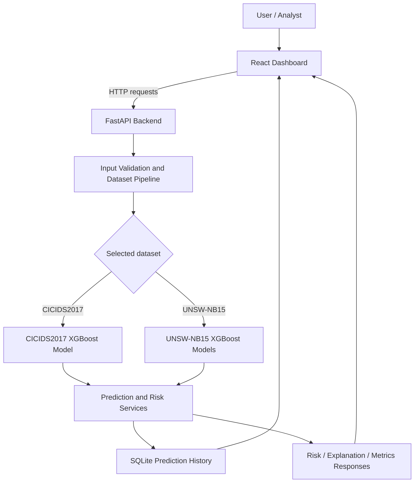

# ML-Based Cyber Attack Analysis, Prediction & Early Warning System

A machine-learning project that helps a user examine network-traffic records, estimate whether a record may represent a cyberattack, identify a likely attack category, and review risk indicators and model explanations.

> **In simple words:** Imagine a security guard checking many vehicles entering a building. Instead of looking at vehicles, this project examines information about network connections. A trained machine-learning model looks for patterns that resemble normal activity or known cyberattacks, then presents its prediction and a risk estimate on a dashboard.

**Important:** This is a research/academic prototype. It analyzes supplied network-flow records or CSV files; it is not a complete replacement for a production intrusion detection system, and the repository does not demonstrate direct capture of live network packets.

---

## Contents

- [What does the project do?](#what-does-the-project-do)
- [Who can use it?](#who-can-use-it)
- [How it works, step by step](#how-it-works-step-by-step)
- [Main features](#main-features)
- [System architecture](#system-architecture)
- [Datasets](#datasets)
- [Machine-learning models](#machine-learning-models)
- [Understanding the results](#understanding-the-results)
- [Technology used](#technology-used)
- [Project folder guide](#project-folder-guide)
- [Run locally](#run-locally)
- [Run with Docker](#run-with-docker)
- [API guide](#api-guide)
- [Model files and datasets](#model-files-and-datasets)
- [Testing and troubleshooting](#testing-and-troubleshooting)
- [Limitations and responsible use](#limitations-and-responsible-use)
- [Future improvements](#future-improvements)
- [Glossary for beginners](#glossary-for-beginners)

---

## What does the project do?

Networks carry information between computers, websites, servers, and other devices. Some connections are ordinary, while others may be part of an attack. Looking at every connection manually can be difficult, especially when there are thousands or millions of records.

This project uses machine learning to help analyze those records. A user can:

1. Enter the details of one network flow manually.
2. Upload a CSV file containing many network-flow records.
3. Select the dataset format the records belong to: **CICIDS2017** or **UNSW-NB15**.
4. View the model's predicted class, attack indication, confidence-related information, and risk score where available.
5. Review previous predictions saved by the application.
6. Explore performance metrics, risk information, and available feature-importance explanations.

The model produces a **prediction**, not absolute proof that an attack has occurred. Results should be reviewed by a knowledgeable person before making important security decisions.

## Who can use it?

- **Students:** to learn about cybersecurity, datasets, and machine learning.
- **Researchers:** to inspect experiment results and compare model behavior.
- **Developers:** to study how a machine-learning model can be connected to a web application.
- **Security learners and analysts:** to explore network-flow classifications and risk indicators in a controlled environment.

You do not need to understand every machine-learning concept before running the application. The sections below explain the important terms in plain language.

## How it works, step by step

### 1. The user provides network data

The input is either a single network-flow record entered through the dashboard or a CSV file containing multiple records. A **network flow** is a summary of communication between devices—for example, how long a connection lasted, how many packets were sent, and how much data was transferred.

### 2. The system checks and prepares the input

The backend checks the request and prepares the features in the format expected by the selected model. Different datasets use different feature names and class labels, so the project keeps their processing pipelines separate.

### 3. A trained model makes a prediction

A trained XGBoost model compares the input's patterns with patterns it learned during training. Depending on the selected dataset and available model, the output may identify normal traffic or a known attack category.

### 4. The system estimates risk

The application can calculate a risk score from the model's probability output. For the documented CICIDS2017 early-warning method:

`Attack probability = 1 − probability of BENIGN traffic`

`Risk score = Attack probability × 100`

A score closer to 100 represents a higher model-estimated likelihood of attack under this project's formula. It is not a universal measure of damage, business impact, or certainty.

### 5. The dashboard displays the result

The React dashboard presents predictions, risk indicators, charts, batch summaries, and prediction history. The backend stores prediction records in SQLite so that the application can display historical results.

### 6. A person reviews the findings

The results help a user decide what to investigate next. They should not be treated as automatic proof of malicious intent or as the sole basis for blocking a device or service.

---

## Main features

| Feature | What it means in plain English |
|---|---|
| Single-record prediction | Check one network-flow record at a time. |
| CSV batch analysis | Upload many records and analyze them together. |
| Attack classification | Predict a normal-traffic or attack category supported by the selected model. |
| Risk scoring | Convert an attack-probability estimate into a score from 0 to 100. |
| Early-warning indicators | Highlight records that cross the project's configured risk threshold or risk bands. |
| Prediction history | Review previous records saved by the application. |
| Performance dashboard | View stored evaluation metrics and class-wise performance information. |
| SHAP-related explanations | Review available feature-importance results showing which input features contributed to model predictions. |
| REST API | Allow the frontend or another client to communicate with the backend. |
| Docker deployment | Package the frontend and backend into containers for a repeatable local deployment. |

Some screens depend on the presence of their corresponding model artifacts and result files. See [Model files and datasets](#model-files-and-datasets) and [Limitations and responsible use](#limitations-and-responsible-use).

## System architecture



### What each part does

- **Frontend (React + TypeScript):** the website the user sees and interacts with.
- **Backend (FastAPI):** receives requests, validates inputs, calls the model code, and returns results.
- **Dataset pipelines:** arrange input columns in the order and format expected by each dataset's model.
- **Model wrappers:** load the saved model files and ask them to make predictions.
- **Risk and explanation services:** prepare risk-related outputs and available feature-attribution information.
- **SQLite database:** keeps a local record of predictions and related fields.
- **Nginx (Docker deployment):** serves the built frontend and forwards API requests to the backend container.

## Datasets

The project uses two well-known network-intrusion datasets. They are processed independently; their feature columns and attack labels are **not merged into one common label system**.

### CICIDS2017

CICIDS2017 is a research dataset containing examples of ordinary network traffic and several categories of malicious traffic. The project code defines **70 network-flow features** and **15 output classes** for its multiclass model.

Examples of labels include:

- `BENIGN` — traffic labeled as normal in the dataset.
- `DDoS` — distributed denial-of-service activity.
- `PortScan` — attempts to discover open ports or services.
- `Bot` — traffic associated with bot activity.
- Web attack labels such as brute force, SQL injection, and cross-site scripting (XSS).

### UNSW-NB15

UNSW-NB15 is another research dataset containing normal activity and different attack categories. The project code defines **42 network-flow features** and **10 classes** for its multiclass model.

Its labels include `Normal`, `DoS`, `Exploits`, `Fuzzers`, `Reconnaissance`, `Backdoor`, `Shellcode`, `Worms`, `Analysis`, and `Generic`.

### Why use two datasets?

Using two separate datasets allows the project to explore model behavior under two different benchmark formats. A model trained for one dataset cannot automatically be assumed to work correctly with the other dataset's columns or labels. Always select the correct dataset for the input file.

**Dataset access:** Raw and large processed datasets are not included in this repository. See [`data/README.md`](data/README.md) and the dataset-specific READMEs for the project's storage policy. Use appropriately licensed dataset copies and follow the original dataset providers' terms.

## Machine-learning models

### XGBoost

XGBoost is a machine-learning method that combines many small decision trees. Each new tree helps improve the overall prediction. In simple terms, the model learns patterns from examples and uses those patterns to classify new records.

The repository includes:

- A multiclass XGBoost model for CICIDS2017, saved in XGBoost's JSON model format.
- A binary XGBoost model for UNSW-NB15, intended to distinguish normal traffic from attack traffic.
- A multiclass XGBoost model for UNSW-NB15, intended to predict among the dataset's attack categories.
- Label-encoder information for mapping model class numbers back to readable labels.

A Random Forest loading path and an LSTM wrapper also exist in the code, but the ZIP does **not** include a Random Forest model artifact, and the LSTM wrapper reports itself as not loaded. Do not assume those two models are currently providing predictions.

### Binary vs. multiclass prediction

- **Binary classification:** answers a two-choice question such as “normal or attack?”
- **Multiclass classification:** chooses among several labels, such as normal traffic, DDoS, PortScan, or another known category.

### SHAP explanations

SHAP is a method for estimating how much individual input features contributed to a model output. For example, it can help identify which network-flow measurements influenced a prediction. A SHAP value is an explanation of model behavior, **not proof that a feature caused an attack**.

The repository includes selected CICIDS2017 SHAP summary files and a plot under `results/cicids2017/Shap/`. Availability of a global explanation does not necessarily mean that every prediction has a complete individual explanation.

## Understanding the results

Metrics are different ways of measuring model performance. They should be read together rather than using accuracy alone.

| Metric | Simple explanation |
|---|---|
| Accuracy | How often the model's predictions were correct overall. |
| Precision | Of the records predicted as attacks, how many were actually attacks in the evaluation labels. |
| Recall | Of the actual attacks in the evaluation labels, how many the model detected. |
| F1-score | A combined measure of precision and recall. |
| False positive | Normal traffic incorrectly flagged as an attack. |
| False negative | An attack incorrectly classified as normal. This can be especially important in security. |
| Confusion matrix | A table showing which classes were correctly predicted and which were confused with others. |

### CICIDS2017 multiclass test results

The stored evaluation summary reports the following results for **383,203 held-out test samples**:

| Metric | Reported value |
|---|---:|
| Accuracy | 99.8659% |
| Macro precision | 92.1818% |
| Macro recall | 92.0359% |
| Macro F1-score | 91.4891% |
| Weighted F1-score | 99.8701% |

The difference between macro and weighted scores matters. **Macro** metrics give each class equal importance, while **weighted** metrics give more influence to classes with more samples. A high overall accuracy can coexist with weaker performance on rare attack types, so per-class reports and confusion matrices are important.

The stored CICIDS2017 risk-evaluation JSON separately reports a threshold of **0.94** on a held-out test set of 383,203 samples:

| Risk-evaluation metric | Reported value |
|---|---:|
| Accuracy | 99.9063% |
| Precision | 99.4766% |
| Recall | 99.9640% |
| F1-score | 99.7197% |
| False positive rate | 0.1052% |
| False negative rate | 0.0360% |

These risk-evaluation metrics describe an attack-versus-benign warning decision and **should not be compared directly with the 15-class multiclass metrics**. The project contains additional per-class reports, confusion matrices, risk-analysis files, and plots under `results/`.

For UNSW-NB15, the repository contains several experiment-stage reports, including binary baseline-versus-optimized comparisons and multiclass reports. Since these files represent different experiment stages, inspect the specific report and its context before quoting a single overall score.

> **Metric transparency note:** The CICIDS2017 test summary text says SHAP, risk scoring, and early warning were not yet started, while separate SHAP and risk-evaluation files are present in the same repository. This appears to be a stale or phase-specific status note. The results should be reconciled before presenting a single definitive project-status statement.

## Technology used

| Technology | Role in the project |
|---|---|
| Python | Backend and machine-learning integration language. |
| FastAPI | Creates HTTP API endpoints for prediction, risk, metrics, and related operations. |
| Uvicorn | Runs the FastAPI application. |
| XGBoost | Provides trained tree-based machine-learning models. |
| NumPy and pandas | Work with numerical arrays and tabular data. |
| SQLAlchemy + SQLite | Store and retrieve prediction history. |
| SHAP-related outputs | Help inspect feature contributions to model predictions. |
| React | Builds the interactive user interface. |
| TypeScript | Adds type checking to frontend code. |
| Vite | Runs the frontend development server and builds production assets. |
| Tailwind CSS | Provides utility-based styling. |
| Recharts | Displays charts in the dashboard. |
| Lucide React | Provides interface icons. |
| Docker Compose | Coordinates the frontend and backend containers. |
| Nginx | Serves the built frontend and proxies API requests in the container deployment. |

## Project folder guide

```text
.
├── backend/
│   ├── app/
│   │   ├── api/routes/       # HTTP endpoints
│   │   ├── core/             # Application configuration and security helpers
│   │   ├── database/         # SQLite connection, models, and repositories
│   │   ├── ml/               # Dataset-specific input pipelines and model registry
│   │   ├── models/           # Model loading and prediction wrappers
│   │   ├── schemas/          # Request/response data structures
│   │   ├── services/         # Prediction, risk, metrics, alerts, explanations
│   │   └── main.py           # FastAPI application entry point
│   ├── tests/                # Backend automated tests
│   └── requirements.txt      # Python backend dependencies
├── frontend/
│   ├── src/
│   │   ├── pages/            # Dashboard, detection, batch, risk, metrics, etc.
│   │   ├── components/       # Reusable UI components
│   │   ├── services/         # Frontend API client functions
│   │   └── types/            # TypeScript data types
│   ├── package.json          # Frontend scripts and dependencies
│   └── vite.config.ts        # Frontend development-server settings
├── model-artifacts/
│   ├── cicids2017/           # CICIDS2017 model and label encoder
│   └── unsw-nb15/            # UNSW-NB15 models and label encoder
├── data/                     # Dataset instructions and split-index files
├── results/                  # Selected metrics, reports, plots, and analysis outputs
├── docs/                     # Architecture, API, and methodology documentation
├── deployment/docker/        # Dockerfiles and Nginx configuration used by Compose
├── docker-compose.yml        # Multi-container application configuration
├── requirements.txt          # Root-level Python dependencies, if using that workflow
└── README.md                 # This guide
```

### Where should a beginner start reading?

1. Start with this README to understand the purpose and flow.
2. Read [`docs/architecture/system-architecture.md`](docs/architecture/system-architecture.md) for the component diagram.
3. Read [`docs/methodology/datasets.md`](docs/methodology/datasets.md) to understand the two datasets.
4. Read [`docs/methodology/models.md`](docs/methodology/models.md) for the model details.
5. Read [`docs/api/api-documentation.md`](docs/api/api-documentation.md) for API examples.
6. Explore `backend/app/services/` for the application logic and `frontend/src/pages/` for the dashboard screens.

---

## Run locally

### Prerequisites

Install the following before starting:

- Python 3.11 or a compatible Python version supported by the dependencies.
- Node.js 20 or a compatible version for the Vite frontend.
- npm (installed with Node.js).
- Git, if you are cloning the repository.

### 1. Get the code

```bash
git clone <YOUR-GITHUB-REPOSITORY-URL>
cd ML-Based-Cyber-Attack-Analysis-Prediction-and-Early-Warning-System-main
```

Replace the URL with the actual GitHub repository URL. The directory name may differ depending on the repository name.

### 2. Start the backend

From the repository root:

**macOS / Linux**

```bash
python3 -m venv venv
source venv/bin/activate
pip install -r backend/requirements.txt
PYTHONPATH=backend uvicorn app.main:app --reload --host 0.0.0.0 --port 8090
```

**Windows PowerShell**

```powershell
py -3.11 -m venv venv
.\venv\Scripts\Activate.ps1
pip install -r backend/requirements.txt
$env:PYTHONPATH = "backend"
uvicorn app.main:app --reload --host 0.0.0.0 --port 8090
```

The backend should be available at:

- API root: <http://localhost:8090/>
- Health check: <http://localhost:8090/health>
- Interactive API documentation: <http://localhost:8090/docs>
- Alternative API documentation: <http://localhost:8090/redoc>

Keep this terminal running.

### 3. Start the frontend

Open a **second terminal** at the repository root:

```bash
cd frontend
npm ci
npm run dev
```

Open the frontend URL printed by Vite. The project config sets the development port to **5180**, so the expected address is <http://localhost:5180>.

The frontend API client defaults to `http://localhost:8090/api/v1`. If your backend runs on a different address or port, configure `VITE_API_URL` appropriately before building or starting the frontend.

### 4. Try the application

1. Open the frontend in your browser.
2. Check the dashboard.
3. Open the single-record detection page and choose the correct dataset.
4. Enter a complete feature record using the feature names expected by that dataset's model.
5. Alternatively, use batch analysis with a compatible CSV containing the required feature columns.
6. Review the returned prediction and risk information.
7. Visit prediction history, performance, risk, and explanation screens to explore the available outputs.

**CSV note:** The backend expects the feature schema for the selected dataset. Arbitrary CSV files, missing columns, different feature names, or incorrectly formatted values may fail validation or produce invalid results. Use data prepared for the corresponding dataset and model.

---

## Run with Docker

Docker Compose is configured to build and run the backend and frontend together.

### Prerequisites

Install Docker Desktop or Docker Engine with the Docker Compose plugin.

### Start the application

From the repository root:

```bash
docker compose config
docker compose build
docker compose up -d
```

Open:

- Frontend dashboard: <http://localhost:5180>
- Backend API: <http://localhost:8090>
- Backend health check: <http://localhost:8090/health>
- API documentation: <http://localhost:8090/docs>

### Useful Docker commands

```bash
# Check running containers
docker compose ps

# View logs
docker compose logs -f backend
docker compose logs -f frontend

# Stop containers (keeps the named database volume)
docker compose down

# Stop containers and delete the named database volume
# WARNING: this removes persisted SQLite data from that volume.
docker compose down -v
```

The Compose configuration stores SQLite data in a named volume mounted at `/data` and mounts `model-artifacts/` read-only into the backend container. Keep the model files in the expected folders before building or starting the backend.

---

## API guide

The API is the communication bridge between the website and the backend. The frontend sends a request, the backend processes it, and then the backend returns a response, usually in JSON format.

Base URL for local development: `http://localhost:8090`

| Method | Endpoint | Purpose |
|---|---|---|
| `GET` | `/` | Basic API information. |
| `GET` | `/health` | Health status and model readiness information. |
| `POST` | `/api/v1/predict` | Predict one network-flow record. |
| `POST` | `/api/v1/predict/batch` | Predict records from a CSV upload. |
| `POST` | `/api/v1/risk` | Calculate risk information from a supplied probability. |
| `GET` | `/api/v1/explain?dataset=cicids2017` | Retrieve available explainability information. |
| `GET` | `/api/v1/metrics` | Retrieve stored evaluation and model metrics. |
| `GET` | `/api/v1/models` | Inspect supported model/dataset information. |
| `GET` | `/api/v1/history` | Retrieve prediction history, with supported query filters. |
| `POST` | `/api/v1/analyze` | Analyze an uploaded network-traffic CSV and return a summary. |

See [`docs/api/api-documentation.md`](docs/api/api-documentation.md) for request examples and response fields. The interactive Swagger UI at `/docs` is the most direct way to inspect the API running on your machine.

### Example: single-record prediction

A request follows this general shape. The feature names and values must match the selected dataset's expected schema; the few values below are illustrative only and are **not** a complete record.

```json
{
  "dataset": "cicids2017",
  "features": {
    "Destination Port": 80,
    "Flow Duration": 1200,
    "Total Fwd Packets": 5
  }
}
```

A successful response can include a predicted label, attack indication, attack probability, confidence-related values, risk score, risk band, and available feature-attribution information. Use `/docs` to confirm the exact request schema required by the running version.

---

## Model files and datasets

The repository includes these model files:

```text
model-artifacts/
├── cicids2017/
│   ├── CICIDS_Multiclass_XGBoost.json
│   ├── CICIDS_Label_Encoder.npy
│   └── CICIDS_XGBoost_Parameters .json
└── unsw-nb15/
    ├── xgboost_cyberattack.pkl
    ├── xgboost_multiclass_attack_classifier.pkl
    └── attack_category_label_encoder.pkl
```

The file `CICIDS_XGBoost_Parameters .json` currently has a space before `.json`. It is metadata, not the main model file; avoid renaming it unless you also check all references.

The code also has an optional Random Forest artifact path, but a Random Forest model file is not included in the supplied repository ZIP. The LSTM wrapper is a placeholder and has no loaded trained model artifact. The main model artifacts listed above are the ones actually present in the ZIP.

Raw and large processed datasets are intentionally kept outside the repository. The `data/` directory includes documentation and CICIDS2017 train/test/validation split-index arrays. These index arrays only make sense when used with the matching dataset version and row order; they are not the dataset itself.

If you share this project with someone else, provide dataset access separately and make sure the recipient obtains the correct source dataset and preprocessing version.

---

## Testing and troubleshooting

### Backend tests

From the repository root, activate your Python virtual environment and run:

```bash
PYTHONPATH=backend pytest backend/tests -v
```

The repository includes tests for health/model readiness, prediction, metrics, and risk endpoints. Test results depend on the installed dependencies and availability of the required model files. Do not assume every test passes simply because the files exist; run the command and review the output.

### Frontend build

From the `frontend/` directory:

```bash
npm ci
npm run build
```

This runs TypeScript checking and creates a production frontend build.

### Common problems

| Problem | What to check |
|---|---|
| `Model artifact not configured` or a model shows `loaded: false` | Confirm the expected model file exists under `model-artifacts/` and that its filename matches the configuration. Check backend logs for model-loading errors. |
| Frontend cannot reach the backend | Confirm the backend is running on port `8090`, and check `VITE_API_URL` or the Vite/Nginx proxy configuration. |
| CSV upload fails | Use a CSV for the selected dataset and confirm all required feature columns are present with compatible values. |
| Database errors | Check `DATABASE_URL`, the database directory's write permissions, and whether the SQLite path is persistent in Docker. |
| Port is already in use | Stop the other process or change the port mapping and corresponding frontend configuration. |
| Docker build cannot find a file | Run `docker compose config` and confirm the Dockerfile paths and Nginx config path exist. |
| Frontend opens but API requests fail in Docker | Inspect `docker compose logs -f backend frontend` and verify the `/api` proxy points to `backend:8090`. |

---

## Limitations and responsible use

- This is a research/learning prototype, not a certified commercial security product.
- The current workflow analyzes user-provided flow records and CSV files. It does not itself demonstrate packet capture, network sensor deployment, or autonomous blocking of traffic.
- Model quality depends on the dataset, data preparation, class balance, feature schema, and how closely new data resembles the training data.
- High overall accuracy does not guarantee reliable detection for every rare attack category. Always examine per-class precision/recall and false negatives.
- A model can generate false positives (normal activity flagged as suspicious) and false negatives (an attack missed).
- Risk bands and the threshold are project-specific settings, not universal cybersecurity standards.
- SHAP explains aspects of model behavior; it does not prove that a feature caused an attack.
- The repository's CICIDS2017 evaluation summary contains a phase-status note that conflicts with the separate SHAP and risk-evaluation files. Reconcile the experimental notes before using them as a final report.
- Do not upload confidential network data, credentials, or sensitive personal information to a public repository.
- Do not use predictions as the sole basis for high-impact security decisions without independent validation and human review.

## Future improvements

Possible next steps include:

- Add a clear, reproducible data-download and preprocessing guide for both datasets.
- Reconcile experiment-stage metrics and document which saved model produced each report.
- Add automated tests for model artifact loading and full end-to-end CSV prediction.
- Add per-class evaluation summaries and confidence/calibration analysis to the dashboard.
- Add stronger file-upload limits, schema validation, authentication, and operational logging before any real deployment.
- Add a trained and validated sequence model only if temporal data and an appropriate evaluation design justify it.
- Add a live network collection component only as a separate, carefully secured integration; it is not currently demonstrated by this repository.

## Glossary for beginners

| Term | Simple meaning |
|---|---|
| **Cyberattack** | An attempt to misuse, disrupt, or gain unauthorized access to a computer system or network. |
| **Network traffic** | Data moving between devices or services. |
| **Network flow** | A summary of a communication session, such as packet counts, bytes, duration, and timing. |
| **Dataset** | A collection of examples used to train or test a model. |
| **Feature** | One piece of information about a network flow, such as destination port or flow duration. |
| **Label / class** | The category assigned to an example, such as `BENIGN`, `DDoS`, or `PortScan`. |
| **Training** | The process where a model learns patterns from examples. |
| **Inference / prediction** | Using a trained model to make a prediction about new input. |
| **XGBoost** | A machine-learning method that combines decision trees to improve predictions. |
| **Binary classification** | Choosing between two categories, such as normal and attack. |
| **Multiclass classification** | Choosing one category from a list of several possible categories. |
| **Accuracy** | The fraction of predictions that were correct overall. |
| **Precision** | How often an attack prediction was correct in the evaluated data. |
| **Recall** | How much of the actual attack activity the model detected in the evaluated data. |
| **False positive** | An incorrect alarm. |
| **False negative** | An attack that the model failed to flag. |
| **Risk score** | A score calculated by the project's chosen formula to represent estimated attack likelihood. |
| **Threshold** | A cutoff value used to decide when a probability should trigger a warning. |
| **SHAP** | A method that estimates how input features contributed to a model output. |
| **API** | A defined way for two software components to communicate. |
| **Backend** | The part of the application that processes requests and runs business logic. |
| **Frontend** | The user-facing website or dashboard. |
| **SQLite** | A lightweight database stored in a file. |
| **Docker** | A tool for packaging an application and its dependencies into containers. |
| **Container** | An isolated environment in which an application runs with its required files and software. |

---

## License

See [`LICENSE`](LICENSE) for the license included with this repository. Check that it matches the terms under which you intend to distribute the project and its included artifacts.

## Acknowledgements

This project builds on the public CICIDS2017 and UNSW-NB15 research datasets and open-source tools including FastAPI, React, XGBoost, SQLite, SHAP-related tooling, and Docker. Refer to the original dataset publications and software licenses when redistributing or using their contents.

