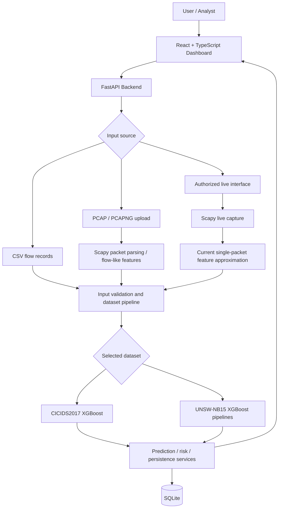

# ML-Based Cyber Attack Analysis, Prediction & Early Warning System

A project that explores how machine learning can help identify suspicious network traffic, understand possible attack types, estimate risk, and present the results in a dashboard.

> **In very simple words:** Every time computers communicate, they send data over a network. This project studies information about that communication and uses trained machine-learning models to decide whether it looks normal or similar to a known cyberattack. The dashboard helps a user review the results. It is a decision-support prototype, not an automatic guarantee that an attack has or has not happened.


### What problem does this project address?

A network can carry both ordinary activity and harmful activity. Examples of harmful activity include someone trying many passwords, scanning for open ports, overwhelming a server with traffic, or exploiting a weakness in an application. Manually checking every network record is difficult. Machine learning can learn patterns from labelled examples and help flag records that resemble known attack patterns.

### What does the system do?

1. **Gets network information:** It can work with supported CSV traffic records, uploaded packet-capture files (PCAP/PCAPNG), and a live-monitoring interface.
2. **Prepares the information:** It checks and converts traffic information into the numeric fields expected by the selected model. These fields are called *features*.
3. **Uses a trained model:** The CICIDS2017 and UNSW-NB15 models are separate because they were trained using different datasets and feature formats.
4. **Produces a prediction:** Depending on the selected pipeline, the output can be normal/attack or a predicted attack category.
5. **Shows supporting information:** The backend can store records and provide risk, incident, monitoring, and explainability information for the dashboard.
6. **Helps a person investigate:** A user can review suspicious records and investigate them further. The prediction alone is not proof that an attack occurred.

### A simple example

Imagine a server receives an unusually large number of connection attempts. A model examines measurable details such as packet counts, flow duration, protocol and byte counts. If those values resemble patterns learned from attack examples, the model may label the traffic as suspicious or assign an attack category. The user should then investigate the record; the model does not independently prove the intent of the sender.

### What is complete, and what still needs work?

The repository includes trained XGBoost model artifacts, dataset-specific prediction pipelines, a web dashboard, backend APIs, traffic-file upload/parsing code, risk/incident services, and monitoring controls. The UNSW-NB15 and CICIDS2017 experiments are separate. However, reliable live attack detection is **not yet validated**: the current live path builds approximate features from individual packets instead of calculating complete bidirectional network flows. A trained LSTM/sequence model is also **not configured**. The sequential-data work described later is a recommended next stage, not a completed feature.

**Project status:** This repository contains a working application foundation, model artifacts, dataset-specific inference pipelines, CSV/PCAP upload routes, a live-monitoring interface, and supporting API/services. However, the live packet path currently creates *single-packet feature approximations* rather than aggregating full bidirectional network flows before inference. Treat live-monitoring predictions as experimental until the flow extraction and feature compatibility have been validated end to end.

This is an academic/research prototype, not a certified production intrusion-detection system. Predictions are indicators for investigation, not proof of malicious activity.

---

## Contents

- [Start here: the project explained simply](#start-here-the-project-explained-simply)
- [Capabilities](#capabilities)
- [Architecture](#architecture)
- [Datasets and models](#datasets-and-models)
- [Attack types in simple words](#attack-types-in-simple-words)
- [Sequential dataset for early warning](#sequential-dataset-for-early-warning)
- [Current implementation status](#current-implementation-status)
- [Repository structure](#repository-structure)
- [Requirements](#requirements)
- [Run locally](#run-locally)
- [Run with Docker Compose](#run-with-docker-compose)
- [Using the application](#using-the-application)
- [API overview](#api-overview)
- [Network traffic analysis](#network-traffic-analysis)
- [Live monitoring and Wireshark](#live-monitoring-and-wireshark)
- [Model artifacts and datasets](#model-artifacts-and-datasets)
- [Evaluation results](#evaluation-results)
- [Tests and validation](#tests-and-validation)
- [Troubleshooting](#troubleshooting)
- [Limitations and responsible use](#limitations-and-responsible-use)
- [Potential next steps](#potential-next-steps)
- [Glossary](#glossary)

---

## Capabilities

The repository includes the following application components:

| Capability | Implementation in this repository |
|---|---|
| Single-flow prediction | FastAPI prediction API with dataset-specific pipelines |
| CSV analysis | Upload endpoint, job records, summaries, result retrieval and export |
| PCAP / PCAPNG analysis | Upload endpoint and Scapy-based packet parsing into flow-like feature records; feature parity with benchmark datasets still needs validation |
| Dataset selection | Separate CICIDS2017 and UNSW-NB15 processing pipelines |
| Risk scoring | Risk service based on model output and configured thresholds |
| Prediction history | SQLite persistence for predictions and traffic-flow records |
| Monitoring controls | Start, stop, status, interface allowlist, recent-flow feed and session statistics |
| Live-monitoring UI | React page polls monitoring status and recent results |
| Incident review | Incident API/service and frontend incident page |
| Explainability | SHAP-related service and saved CICIDS2017 SHAP artifacts |
| Model-performance page | Dashboard showing stored/defined evaluation metrics |
| Container setup | Docker Compose, backend image, frontend image and Nginx configuration |

Some screens may show predefined metrics or saved experimental results rather than metrics recalculated from a model at runtime. Check the source and the API response before interpreting a dashboard value as a live measurement.

## Architecture



### The architecture in everyday language

Think of the system as a series of stations:

- **Input station:** receives a traffic CSV, a packet-capture file, or traffic seen on an authorized interface.
- **Preparation station:** extracts measurable values and checks which dataset format is being used.
- **Prediction station:** sends the values to the matching trained model.
- **Review station:** records the prediction and related risk/incident information where supported.
- **Dashboard:** displays available results so a person can review them.

A *packet* is one small unit of network data. A *flow* is a summary of related traffic between endpoints over time. The models expect flow-style features, so reliable live monitoring needs to collect packets and calculate complete flow statistics before sending them to the model. That final live-flow step is still a key limitation in this version.

### Main components

- **Frontend:** React, TypeScript, Vite, Tailwind CSS and Recharts.
- **Backend:** FastAPI, Pydantic, SQLAlchemy and Uvicorn.
- **ML:** XGBoost, scikit-learn, NumPy, pandas, and dataset-specific preprocessing.
- **Traffic capture/parsing:** Scapy for PCAP/PCAPNG parsing and authorized live packet capture.
- **Persistence:** SQLite, configured through `DATABASE_URL`.
- **Explainability:** SHAP-related service and saved experiment artifacts.
- **Deployment:** Docker Compose with Nginx serving the frontend and forwarding API requests.

---

## Datasets and models

The project uses two independent benchmark datasets. Their feature schemas and label taxonomies must remain separate.

### CICIDS2017

CICIDS2017 is a labelled cybersecurity dataset created for intrusion-detection research. In simple terms, it contains examples of normal traffic and several attack types.

- The application pipeline defines **70 input features** and **15 output classes**.
- The saved multiclass XGBoost model is stored in XGBoost JSON format.
- Example labels include `BENIGN`, `DDoS`, `PortScan`, `Bot`, and several DoS, brute-force, and web-attack classes.

### UNSW-NB15

UNSW-NB15 is another labelled network-intrusion dataset. It has its own feature columns and attack categories, so its data must be prepared using its own pipeline.

- The application pipeline defines **42 input features** and **10 multiclass labels**.
- The repository includes a binary XGBoost artifact and a multiclass XGBoost artifact.
- The multiclass taxonomy includes `Normal`, `DoS`, `Exploits`, `Fuzzers`, `Reconnaissance`, `Backdoor`, `Shellcode`, `Worms`, `Analysis`, and `Generic`.

### Attack types in simple words

Attack names differ between datasets. The following descriptions are general explanations; a label means the dataset or model assigned that category, not that the label is always correct.

| Attack label or family | Easy explanation |
|---|---|
| **DoS** | Denial of Service: traffic or requests are used to make a service slow or unavailable. |
| **DDoS** | Distributed Denial of Service: many devices send traffic toward a target to overwhelm it. |
| **Port scan / Reconnaissance** | Someone checks systems, ports, or services to discover what is available. This can also have legitimate uses. |
| **Brute force** | Repeated login or password attempts to try to gain access. |
| **Web attack** | Requests attempt to misuse or exploit a website or web application. |
| **Bot / Botnet** | A device or group of devices may be controlled to carry out automated activity. |
| **Exploit** | Activity that attempts to take advantage of a software or configuration weakness. |
| **Fuzzing** | Many unusual or specially formed inputs are sent to see how a system responds; it can be used for testing or attack attempts. |
| **Backdoor** | A hidden or unintended way to access a system. |
| **Shellcode** | Small code used in some exploit techniques to perform actions on a compromised system. |
| **Worm** | Malicious software that can spread from one system to another. |
| **Generic / Analysis** | Dataset-specific broad categories; their exact meaning depends on how the dataset was labelled. |
| **Normal / BENIGN** | The dataset labels the activity as ordinary rather than as one of its listed attacks. |

### Model registry

The model registry reports readiness for the CICIDS2017 and UNSW-NB15 pipelines when their configured artifacts can be loaded. The current LSTM wrapper explicitly reports that no trained temporal model is configured. **Do not describe LSTM-based forecasting or sequence early warning as implemented.**

A model's ability to return a prediction does not automatically mean that arbitrary live traffic can be classified accurately. Inference inputs must be compatible with the model's training features, units, order, encoding, and preprocessing.

---

## Sequential dataset for early warning

### Recommended next dataset: CSE-CIC-IDS2018

For the next stage of the project—studying how network behaviour changes over time—the recommended dataset is **CSE-CIC-IDS2018**: <https://www.unb.ca/cic/datasets/ids-2018.html>. The dataset is organized by capture day and includes labelled network-flow CSV files and packet captures. Its time information can support experiments that use earlier traffic to study whether a later attack event may be approaching. Check the official dataset page for the available files and usage details.

**Why use a sequential dataset?** The existing CICIDS2017 processed CSV that was inspected for this project did not contain a timestamp column. A row's position in a CSV does not automatically prove when the traffic happened. A temporal model needs trustworthy time information and a clear definition of what it should warn about in the future.

### A practical plan

1. Download a manageable subset of CSE-CIC-IDS2018 from the official source.
2. Inspect its columns and confirm which timestamp and label fields are present in the chosen files.
3. Clean the data and sort records by timestamp. Keep the dataset's own label definitions; do not merge them blindly with CICIDS2017 or UNSW-NB15 labels.
4. Use the existing XGBoost models only with their own compatible feature schemas. Do not assume a model trained on CICIDS2017 or UNSW-NB15 can directly consume CSE-CIC-IDS2018 records.
5. Define the warning target clearly—for example, whether an attack occurs within a future time window after a sequence of earlier traffic records. The future label must not be included in the input features.
6. Build chronological sequences or time windows and split training/testing by time or capture scenario to reduce information leakage.
7. Train and evaluate a separate temporal model, such as an LSTM, only after the sequence inputs and future-event target are defined. Compare it against a simpler baseline.
8. Report precision, recall, F1, false alarms, missed attacks, and how early a warning was produced—not accuracy alone.

**Important status note:** This is a recommended future development path. The repository's LSTM wrapper is currently only a placeholder; a trained LSTM model and validated future-attack forecasting are not currently configured.

**Alternative:** ToN-IoT (<https://research.unsw.edu.au/projects/toniot-datasets>) may be more suitable if the project later expands toward IoT devices and combines network traffic with device telemetry or operating-system logs.

---

## Current implementation status

This section distinguishes code that exists from behavior that still needs end-to-end validation.

| Area | Status based on repository inspection |
|---|---|
| CICIDS2017 XGBoost artifact and inference pipeline | Present; unit tests are provided for readiness and probability shape |
| UNSW-NB15 binary and multiclass XGBoost artifacts | Present; unit tests are provided for inference output shape |
| Random Forest model artifact | No Random Forest artifact found in the supplied repository ZIP |
| LSTM temporal model | Wrapper placeholder only; no trained model artifact configured |
| CSV upload and analysis jobs | Routes and job-service integration present; validate using a real compatible CSV |
| PCAP / PCAPNG upload | Route and Scapy parser present; benchmark feature equivalence and prediction quality require validation |
| Live capture controls and UI | Present, including permitted-interface configuration, start/stop, status and recent-flow endpoints |
| Live traffic feature construction | Experimental: current live handler derives a feature record from each packet instead of accumulating a complete bidirectional flow |
| Live attack predictions | Inference is called by the live pipeline, but output quality should not be treated as validated until flow aggregation and schema compatibility are corrected/tested |
| Risk and incident features | Services, API routes and UI components present; verify persistence and end-to-end behavior |
| SHAP | Service and saved CICIDS2017 global SHAP artifacts present; verify whether a response is global or truly sample-specific |
| Dashboard performance metrics | Some values are defined directly in the frontend; do not assume they are fetched dynamically unless confirmed in the current implementation |
| Docker Compose | Configuration and Dockerfiles present; build and run locally to confirm the current environment |

**Important next engineering step:** implement proper bidirectional flow aggregation for live traffic, then calculate the exact features required by the selected dataset pipeline. Do not silently fill incompatible or unavailable features with zero and treat the resulting prediction as trustworthy.

### Project work in plain language

- **Model experiments:** XGBoost classification experiments have been carried out for UNSW-NB15 and CICIDS2017, with saved artifacts and evaluation outputs in the repository.
- **Risk and explanation work:** the repository contains threshold-based risk-analysis outputs and SHAP-related artifacts/services. Their exact meaning should be checked against the experiment files before presenting them as results.
- **Application work:** the backend and frontend connect model inference with traffic upload, monitoring controls, result history, risk/incident views, and performance screens.
- **Still to validate:** the complete application has not been confirmed here as passing all tests or as production-ready. CSV/PCAP end-to-end behavior, Docker builds, dashboard data sources, and live capture accuracy should be tested in the actual environment.
- **Next research stage:** use timestamped sequential data such as CSE-CIC-IDS2018 to develop and evaluate a separate temporal early-warning model. Do not describe this future model as already trained.

---

## Repository structure

```text
.
├── backend/
│   ├── app/
│   │   ├── api/routes/       # Prediction, risk, traffic, monitoring, incidents, etc.
│   │   ├── core/             # Configuration and security helpers
│   │   ├── database/         # SQLAlchemy models, connection and repositories
│   │   ├── ml/               # Model registry and dataset-specific pipelines
│   │   ├── models/           # Model wrappers, including the untrained LSTM placeholder
│   │   ├── services/         # Prediction, traffic parsing, capture, risk, jobs, incidents
│   │   └── main.py            # FastAPI application
│   ├── tests/                # Backend test suite
│   └── requirements.txt
├── frontend/
│   ├── src/pages/             # Dashboard, live monitoring, risk, incidents, performance
│   ├── src/services/          # API clients
│   └── package.json
├── model-artifacts/
│   ├── cicids2017/
│   └── unsw-nb15/
├── data/                      # Dataset documentation and split-index metadata
├── results/                   # Experiment metrics, plots, SHAP and risk-analysis outputs
├── docs/
│   ├── api/
│   └── architecture/
├── deployment/
│   └── docker/                # Dockerfiles and Nginx configuration used by Compose
├── docker-compose.yml
├── requirements.txt
└── README.md
```

---

## Requirements

For local development:

- Python **3.11** recommended (the backend Dockerfile uses Python 3.11).
- Node.js and npm compatible with the Vite frontend (Docker uses Node.js 20).
- Git.
- Optional: Docker Desktop / Docker Engine and Docker Compose.
- For live packet capture: Scapy dependencies, OS-level packet-capture permissions, and an interface that can actually observe the traffic of interest.

On macOS/Linux, packet capture may require elevated privileges or capture permissions. Only monitor networks and interfaces for which you have authorization.

## Run locally

### 1. Clone the repository

```bash
git clone <YOUR_REPOSITORY_URL>
cd ML-Based-Cyber-Attack-Analysis-Prediction-and-Early-Warning-System
```

If you already have the repository, open a terminal at its root directory instead.

### 2. Create a Python environment and install backend dependencies

**macOS / Linux**

```bash
python3.11 -m venv .venv
source .venv/bin/activate
python -m pip install --upgrade pip
pip install -r backend/requirements.txt
```

**Windows PowerShell**

```powershell
py -3.11 -m venv .venv
.\.venv\Scripts\Activate.ps1
python -m pip install --upgrade pip
pip install -r backend/requirements.txt
```

### 3. Start the backend

From the repository root, with the virtual environment activated:

**macOS / Linux**

```bash
PYTHONPATH=backend uvicorn app.main:app --reload --host 0.0.0.0 --port 8090
```

**Windows PowerShell**

```powershell
$env:PYTHONPATH = "backend"
uvicorn app.main:app --reload --host 0.0.0.0 --port 8090
```

Open:

- API root: <http://localhost:8090/>
- Health: <http://localhost:8090/health>
- Swagger UI: <http://localhost:8090/docs>
- ReDoc: <http://localhost:8090/redoc>

Keep the backend terminal running.

### 4. Start the frontend

Open a second terminal:

```bash
cd frontend
npm ci
npm run dev
```

Open the URL printed by Vite. The project is configured to use port **5180** in development, so the expected address is <http://localhost:5180>.

The frontend API client defaults to `http://localhost:8090/api/v1`. If the backend runs at a different address, configure `VITE_API_URL` as required by the frontend API client.

### 5. Try the application

1. Check the dashboard and model readiness.
2. Open the detection page and select the correct dataset.
3. Submit a complete flow record or a compatible dataset CSV.
4. Try a PCAP/PCAPNG upload with a small capture file.
5. Review the resulting job, prediction, risk information and stored history.
6. Use the live-monitoring page with the `test0` simulation first; it does not require OS packet-capture permissions.
7. Only test actual capture on an authorized interface after verifying permissions and the feature-extraction pipeline.

---

## Run with Docker Compose

From the repository root:

```bash
docker compose config
docker compose build
docker compose up -d
```

Open:

- Frontend: <http://localhost:5180>
- Backend: <http://localhost:8090>
- Health: <http://localhost:8090/health>
- API docs: <http://localhost:8090/docs>

Useful commands:

```bash
docker compose ps
docker compose logs -f backend
docker compose logs -f frontend
docker compose down
```

To remove containers **and the persisted database volume**, use the following only if you intend to delete the saved SQLite data:

```bash
docker compose down -v
```

Compose mounts model artifacts read-only and stores the SQLite database in a named volume at `/data`. Confirm that the expected model artifacts exist before starting the service.

**Live-capture note:** Containerized packet capture can require additional host capabilities, permissions, and interface visibility. The current Compose file does not configure privileged packet-capture capabilities. Test simulated monitoring in Docker first; configure real capture deliberately and securely if required.

---

## Using the application

### CSV analysis

Use a CSV whose feature columns correspond to the selected dataset pipeline. The CICIDS2017 and UNSW-NB15 schemas are not interchangeable. An unrelated CSV, a dataset with different preprocessing, or a CSV missing required features may fail or produce invalid results.

### PCAP / PCAPNG analysis

The traffic upload endpoint accepts `.pcap` and `.pcapng` file extensions. The parser groups packets by a bidirectional endpoint/protocol key and computes flow-like statistics. This is a useful starting point for offline capture analysis, but **it does not guarantee exact reproduction of the original CICIDS2017 or UNSW-NB15 feature-generation process**. Validate feature definitions and units before using predictions as evidence.

Uploads are subject to the configured maximum file size. The parser also applies a packet-count limit, so a large capture may be only partially processed. Check job status and analysis counts rather than assuming the entire capture was analyzed.

### Live monitoring

The monitoring page supports:

- Listing the configured permitted interfaces.
- Starting and stopping a monitoring session.
- Checking capture status, uptime, packet counts, flow counts and attack counts.
- Polling for recent classified records.
- A `test0` simulated capture mode for development and automated testing.

The current live capture handler processes each observed IPv4 packet into an approximate feature record and sends it to the shared inference pipeline. It does **not** yet maintain a complete bidirectional flow with the packet counts, inter-arrival times, durations, and other statistics required by the benchmark datasets. As a result, live monitoring currently demonstrates the capture-to-inference integration path, but its attack classifications should be considered experimental and not validated for operational detection.

For reliable live prediction, replace the per-packet approximation with a flow table (for example, a 5-tuple key with forward/reverse direction, flow timeouts and proper feature calculations), then verify that the output matches the selected model's training schema.

---

## API overview

Base URL: `http://localhost:8090`

Use <http://localhost:8090/docs> for the exact schemas exposed by the running application.

| Method | Endpoint | Purpose |
|---|---|---|
| `GET` | `/` | Basic API information |
| `GET` | `/health` | Backend health and model readiness |
| `POST` | `/api/v1/predict` | Predict a single network-flow record |
| `POST` | `/api/v1/predict/batch` | Batch prediction from CSV, if supported by the current route schema |
| `POST` | `/api/v1/analyze` | Analyze an uploaded traffic CSV |
| `POST` | `/api/v1/traffic/upload` | Upload CSV, PCAP or PCAPNG for analysis |
| `GET` | `/api/v1/traffic/jobs` | List analysis jobs |
| `GET` | `/api/v1/traffic/jobs/{job_id}` | Get job status and summary |
| `GET` | `/api/v1/traffic/jobs/{job_id}/results` | Retrieve analyzed flow results |
| `GET` | `/api/v1/traffic/jobs/{job_id}/download` | Export analysis results |
| `GET` | `/api/v1/traffic/flows` | Retrieve recent stored flow records |
| `GET` | `/api/v1/monitoring/interfaces` | List permitted capture interfaces |
| `GET` | `/api/v1/monitoring/status` | Current monitoring state and counters |
| `POST` | `/api/v1/monitoring/start` | Start authorized passive monitoring |
| `POST` | `/api/v1/monitoring/stop` | Stop monitoring |
| `GET` | `/api/v1/monitoring/statistics` | Current and previous monitoring sessions |
| `GET` | `/api/v1/monitoring/flows` | Retrieve recent live-monitoring records |
| `GET` | `/api/v1/risk/early-warning` | Retrieve configured risk/threshold information |
| `GET` / `POST` | `/api/v1/explain` | Retrieve available explainability output |
| `GET` | `/api/v1/metrics` | Retrieve model or evaluation metrics, depending on implementation |
| `GET` | `/api/v1/incidents` | Retrieve incidents, subject to the current route schema |

### Example single-flow prediction request

The following is only a **partial illustrative shape**. It is not a complete valid feature record:

```json
{
  "dataset": "cicids2017",
  "features": {
    "Destination Port": 80,
    "Flow Duration": 1200,
    "Total Fwd Packets": 5
  }
}
```

Submit a complete record matching the actual request schema and model feature requirements. Do not interpret example values as a known attack.

### Start and stop live monitoring

Example request to start the built-in simulation:

```bash
curl -X POST http://localhost:8090/api/v1/monitoring/start \
  -H "Content-Type: application/json" \
  -d '{"interface":"test0","dataset":"cicids2017"}'
```

Check status:

```bash
curl http://localhost:8090/api/v1/monitoring/status
```

Retrieve recent flows:

```bash
curl "http://localhost:8090/api/v1/monitoring/flows?limit=10"
```

Stop monitoring:

```bash
curl -X POST http://localhost:8090/api/v1/monitoring/stop
```

The `test0` interface generates simulated records. Those records are useful for testing the UI and monitoring lifecycle, **not** for measuring real-world model accuracy.

---

## Network traffic analysis

### Where Wireshark fits

Wireshark is useful for manually inspecting a capture: packet headers, protocol fields, TCP flags, endpoints, conversations and suspicious traffic patterns. It is not the ML classifier itself.

For a project workflow:

1. Capture or obtain an authorized PCAP/PCAPNG file.
2. Inspect it with Wireshark if needed.
3. Submit it to the application's traffic upload endpoint for parsing.
4. Extract flow-level statistics and validate feature compatibility.
5. Run the appropriate dataset model.
6. Review predictions and investigate suspicious traffic in Wireshark.

TShark can also be useful for command-line packet-field extraction, but packet fields alone do not necessarily reproduce all features used by the benchmark model. The extraction pipeline must match the model's feature definitions.

### Why model-compatible features matter

The models were trained on benchmark flow records, not arbitrary raw packets. A live pipeline must compute compatible features, including definitions and units for duration, packet counts, bytes, inter-arrival times, flags, and any dataset-specific fields. Filling unavailable fields with zeros can make inference technically run while producing misleading results.

---

## Model artifacts and datasets

The supplied repository ZIP contains these main artifacts:

```text
model-artifacts/
├── cicids2017/
│   ├── CICIDS_Multiclass_XGBoost.json
│   ├── CICIDS_Label_Encoder.npy
│   └── CICIDS_XGBoost_Parameters .json
└── unsw-nb15/
    ├── attack_category_label_encoder.pkl
    ├── xgboost_cyberattack.pkl
    └── xgboost_multiclass_attack_classifier.pkl
```

The CICIDS parameter file currently contains a space before `.json` in its filename. Check code references before renaming it.

The optional Random Forest artifact path is referenced in project history, but no Random Forest model file was found in the supplied ZIP. The LSTM wrapper is a placeholder and has no trained temporal weights configured.

Raw/large processed datasets are not included in the repository. `data/` contains documentation and CICIDS2017 split-index arrays. The index arrays only apply to the matching dataset version and row ordering; they are not the dataset itself. Obtain datasets from their official providers and follow their terms.

- CICIDS2017: <https://www.unb.ca/cic/datasets/ids-2017.html>
- UNSW-NB15: <https://research.unsw.edu.au/projects/unsw-nb15-dataset>

---

## Evaluation results

The repository includes experiment outputs under `results/`, including classification reports, confusion matrices, threshold analysis, risk-analysis files and SHAP artifacts.

The saved `results/cicids2017/Metrics/CICIDS_Test_Evaluation_Summary.txt` reports the following multiclass test-set metrics for **383,203 samples**:

| Metric | Reported value |
|---|---:|
| Accuracy | 0.998659 |
| Macro precision | 0.921818 |
| Macro recall | 0.920359 |
| Macro F1 | 0.914891 |
| Weighted precision | 0.998810 |
| Weighted recall | 0.998659 |
| Weighted F1 | 0.998701 |

The same summary lists lower-performing minority classes and confusion between some web-attack categories. Overall accuracy alone can hide poor performance on rare classes, so review class-wise precision, recall, F1, support and false negatives.

A separate file, `results/cicids2017/Risk_Analysis/CICIDS_Final_Early_Warning_Metrics.json`, reports a threshold-based binary risk experiment on the held-out test set, including threshold 0.94 and separate precision/recall/F1 values. This is a **different evaluation task** from the 15-class classification report. Do not combine the metrics as though they describe the same model output or experiment without checking the experiment scripts and methodology.

The frontend's model-performance page also contains hard-coded metric values. Before using screenshots or dashboard numbers in a report, reconcile those values against the saved result files and document their source. These benchmark results do not establish accuracy on arbitrary live network traffic.

---

## Tests and validation

From the repository root, with backend dependencies installed:

```bash
PYTHONPATH=backend pytest backend/tests -v
```

The repository includes tests for traffic upload/jobs, monitoring lifecycle, model readiness/inference, prediction, risk and incident-related behavior. Tests have **not been claimed as passing by this README**; run them in your environment and inspect failures.

Frontend production build:

```bash
cd frontend
npm ci
npm run build
```

Docker configuration validation:

```bash
docker compose config
```

Recommended manual validation sequence:

1. Confirm `/health` reports the expected model artifacts as ready.
2. Run a prediction using a complete, known-compatible CICIDS2017 record.
3. Run a prediction using a complete, known-compatible UNSW-NB15 record.
4. Upload a small compatible CSV and check job status and result count.
5. Upload a small PCAP/PCAPNG capture and inspect the extracted flow fields.
6. Start `test0` monitoring, verify the UI updates, and stop the session.
7. Only after the above steps, test actual authorized packet capture.
8. Compare live/PCAP feature calculations against the original dataset feature-generation method before evaluating detection quality.

---

## Troubleshooting

| Problem | Checks |
|---|---|
| Model is not ready | Check artifact paths, filenames, backend logs and `/health` |
| CSV upload fails | Confirm the selected dataset, required columns, data types and feature schema |
| PCAP upload returns an error | Check Scapy installation, file format, upload size, file integrity and backend logs |
| No packets are captured | Verify the interface name, capture permissions, interface visibility and allowlist configuration |
| `test0` shows activity but the network interface does not | `test0` is simulated; choose a real permitted interface for actual capture |
| Live predictions look implausible | Current live capture uses per-packet feature approximations; do not treat them as benchmark-compatible flow predictions |
| Frontend cannot reach backend | Confirm port `8090`, `VITE_API_URL`, and Nginx `/api` proxy configuration |
| Database errors | Check `DATABASE_URL`, SQLite path and write permissions |
| Docker capture does not work | Host packet-capture permissions/capabilities and interface visibility may not be available inside the container |
| Performance metrics differ between pages and result files | The UI contains predefined values; reconcile against the experiment output and source before reporting |

---

## Limitations and responsible use

- This is an academic/research prototype, not a certified commercial security product.
- CICIDS2017 and UNSW-NB15 are separate model schemas; their features and labels are not interchangeable.
- PCAP parsing computes flow-like statistics, but exact parity with the original dataset generation pipeline must be demonstrated.
- Current live capture processes packets individually into approximate feature records. Reliable live intrusion classification requires proper flow aggregation and validated feature compatibility.
- The LSTM temporal model is not trained/configured. Do not claim sequence-based forecasting or future-attack prediction is operational.
- High overall accuracy does not guarantee reliable detection of rare attacks or performance on new environments.
- Risk scores are project-specific estimates, not universal measures of severity or business impact.
- SHAP attribution can help explain model behavior, but it does not prove causation.
- Network capture may require elevated privileges. Monitor only systems and networks you are authorized to inspect.
- The application is intended for passive monitoring and investigation. Do not use predictions as the sole basis for blocking traffic or taking other high-impact security actions.
- Avoid committing sensitive captures, credentials, private IP inventories, or personal data to a public repository.

## Potential next steps

1. Replace live single-packet approximations with a bounded bidirectional flow table, timeouts and direction-aware statistics.
2. Validate feature-by-feature parity with CICIDS2017 and UNSW-NB15 model schemas; reject unsupported inputs instead of fabricating missing features.
3. Add reproducible PCAP tests with known captures and compare extracted features against reference flow output.
4. Make dashboard metrics load from a single documented source of truth rather than hard-coded values.
5. Reconcile multiclass evaluation, risk-threshold evaluation, SHAP outputs and the exact model artifacts that produced them.
6. Add collector health, dropped-packet counters, resource limits, capture lifecycle tests and better failure reporting.
7. Train and evaluate a temporal model only if timestamped chronological data and a well-defined future-event target are available.

## Glossary

- **Network packet:** A unit of data transmitted across a network.
- **Network flow:** A summary of traffic exchanged between endpoints over a period of time.
- **Feature:** A measurable input value, such as packet count, flow duration, or byte rate.
- **Classification:** A model's selection of a label, such as normal traffic or an attack category.
- **False positive:** Normal traffic incorrectly flagged as suspicious.
- **False negative:** An attack that the model fails to detect.
- **Risk score:** A project-defined numeric summary derived from model output; it is not a guarantee of actual harm.
- **PCAP / PCAPNG:** File formats used to store captured network packets.
- **Wireshark:** A graphical tool for inspecting captured packets and network protocols.
- **TShark:** The command-line packet analyzer associated with Wireshark.
- **SHAP:** A method for estimating how input features contribute to a model's output.
- **Early warning:** In this project, a threshold-triggered risk indicator; genuine temporal forecasting would require a trained temporal model and chronological validation.
