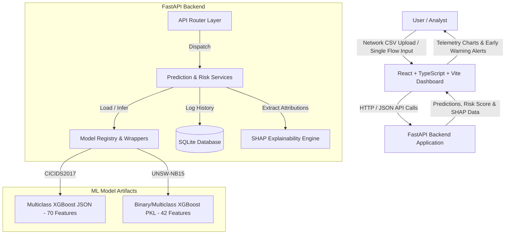

# System Architecture Specification

## Overview

The **ML-Based Cyber Attack Analysis, Prediction & Early Warning System** provides a modular, end-to-end framework for network traffic intrusion detection, threat classification, SHAP feature attribution, and calibrated risk estimation.

## Mermaid System Architecture Diagram

## Component Architecture

1. **Frontend**: React 18 SPA built with TypeScript, Vite, Tailwind CSS, and Recharts. Serves responsive cybersecurity monitoring telemetry.
2. **Backend Services**: FastAPI RESTful API architecture running Uvicorn.
3. **Model Inference Wrappers**: XGBoost Python API wrappers for `CICIDS2017` (15 classes) and `UNSW-NB15` (10 classes).
4. **Database Layer**: SQLite repository layer storing prediction records, risk scores, confidence margins, and input flow audit logs.
